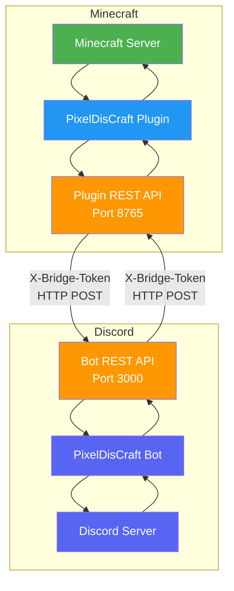
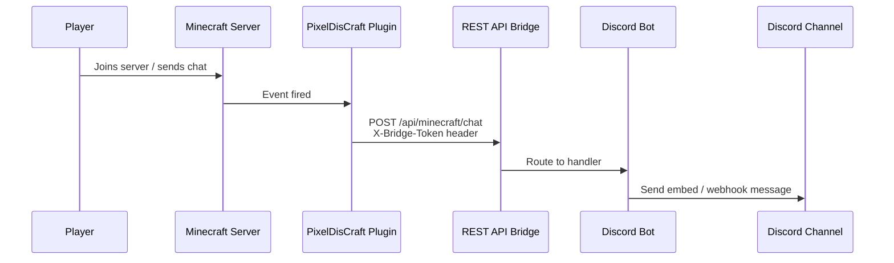
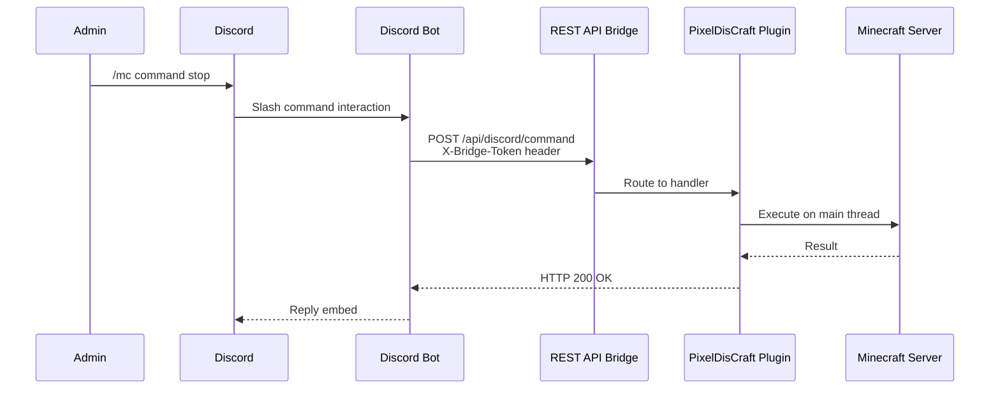

<p align="center">
  
  
  
  
</p>

<h1 align="center">⛏ PixelDisCraft</h1>

<p align="center">
  <strong>A professional Minecraft ↔ Discord integration system that connects a PaperMC server with a Discord bot to provide chat bridging, moderation tools, and real-time server monitoring.</strong>
</p>

<p align="center">
  <a href="#-features">Features</a> •
  <a href="#-architecture">Architecture</a> •
  <a href="#-visual-diagrams">Diagrams</a> •
  <a href="#-compatibility">Compatibility</a> •
  <a href="#-installation">Installation</a> •
  <a href="#-configuration">Configuration</a> •
  <a href="#-usage">Usage</a> •
  <a href="#-releases">Releases</a> •
  <a href="#-license">License</a>
</p>

---

## 📖 Overview

**PixelDisCraft** bridges your Minecraft server and Discord community into one unified experience. Events from your Minecraft server — player joins, chat messages, deaths, and more — are relayed to Discord in real time. Server admins can execute Minecraft commands directly from Discord slash commands. Players can link their accounts, view live stats, and stay connected even when off the server.

The system is composed of two parts:

| Component | Technology | Role |
|-----------|-----------|------|
| **PixelDisCraft Plugin** | Java 17 · PaperMC 1.20.4+ | Captures Minecraft events, exposes a REST API, executes commands |
| **PixelDisCraft Bot** | Node.js 18+ · discord.js v14 | Receives events, sends Discord messages, handles slash commands |

Communication between the plugin and bot is secured via a shared **secret token** transmitted over a private REST API bridge.

---

## ✨ Features

| Feature | Description |
|---------|-------------|
| 💬 **Chat Bridge** | Bi-directional chat between Minecraft and Discord |
| 🟢 **Join / Leave Notifications** | Player connection status posted to Discord |
| ☠️ **Death Messages** | In-game death events forwarded to a log channel |
| 📊 **Server Status** | `/server` slash command shows TPS, RAM, player count |
| 🔨 **Remote Commands** | `/mc`, `/kick`, `/ban` commands from Discord |
| 🔗 **Account Linking** | Link Minecraft and Discord accounts with `/link` |
| 🛡️ **Role Sync** | Minecraft permissions ↔ Discord roles |
| 📸 **Screenshots** | Server-side player info snapshots sent to Discord |
| 🔊 **Voice Channels** | Auto-create/delete voice channels per player |
| 📈 **Player Stats** | Track kills, deaths, playtime via `/stats` |
| 👥 **Player List** | `/players` command shows who's online |

---

## 🏗 Architecture

PixelDisCraft follows a **two-service architecture** communicating over a private REST API bridge.

```
┌─────────────────────┐          REST API          ┌─────────────────────┐
│                     │◄──────── (secured) ────────►│                     │
│   Minecraft Server  │          X-Bridge-Token     │    Discord Server   │
│   + PixelDisCraft   │                             │    + PixelDisCraft  │
│     Plugin          │  Plugin API  ←→  Bot API    │      Bot            │
│   (Java · PaperMC)  │  port 8765       port 3000  │   (Node.js · d.js) │
│                     │                             │                     │
└─────────────────────┘                             └─────────────────────┘
```

**Key design principles:**

- **Token-secured REST API** — All requests carry an `X-Bridge-Token` header
- **Async communication** — No blocking on the Minecraft main thread
- **Retry with backoff** — Failed HTTP calls retry up to 3 times with exponential backoff
- **Rate-limited message queue** — Bot throttles outbound Discord messages (5 msg/sec max)

> 📄 Full architecture document: [docs/architecture.md](docs/architecture.md)

---

## 📐 Visual Diagrams

### System Architecture



> 📄 More diagrams: [diagrams/architecture-diagram.md](diagrams/architecture-diagram.md) · [diagrams/event-flow-diagram.md](diagrams/event-flow-diagram.md) · [diagrams/command-flow-diagram.md](diagrams/command-flow-diagram.md)

### Event Flow (Minecraft → Discord)



### Command Flow (Discord → Minecraft)



---

## 🧩 Compatibility

PixelDisCraft requires **PaperMC 1.20.4 or newer**.

The plugin has been tested on:

- PaperMC 1.20.4
- PaperMC 1.21+

Because the plugin uses only the **Paper API** and does not rely on internal Minecraft server code (NMS), it should work on most modern PaperMC builds starting from version 1.20.4.

> **Minimum:** PaperMC 1.20.4 · **Recommended:** PaperMC 1.21+

If you encounter compatibility issues on a specific Minecraft version, please [open an issue](https://github.com/PGGAMER9911/PixelDisCraft/issues).

---

## 📥 Installation

### Prerequisites

| Requirement | Version |
|-------------|--------|
| Java | 17+ |
| PaperMC | 1.20.4+ |
| Node.js | 18+ |
| npm | 9+ |
| Discord Bot Token | [Discord Developer Portal](https://discord.com/developers/applications) |

### Quick Start

```bash
# 1. Download the plugin JAR from GitHub Releases
#    → https://github.com/PGGAMER9911/PixelDisCraft/releases

# 2. Place PixelDisCraft.jar in your server's plugins/ folder
cp PixelDisCraft-1.0.jar /path/to/server/plugins/

# 3. Start the server once to generate config.yml
java -jar paper-1.2x.x.jar

# 4. Edit plugins/PixelDisCraft/config.yml with your settings

# 5. Install and configure the Discord bot
cd discord-bot
npm install
cp .env.example .env
# Edit .env with your bot token and settings

# 6. Start the bot
node src/index.js
```

> 📄 Full installation guide: [docs/installation.md](docs/installation.md)

---

## ⚙ Configuration

The plugin generates a `config.yml` on first run. Key sections:

```yaml
discord:
  bot-token: "YOUR_BOT_TOKEN"
  guild-id: "YOUR_GUILD_ID"
  chat-channel-id: "CHANNEL_ID"
  log-channel-id: "CHANNEL_ID"

bridge:
  secret-token: "CHANGE_ME_TO_A_SECURE_TOKEN"
  api-port: 8765
  bot-api-url: "http://localhost:3000"

features:
  chat-bridge: true
  join-leave: true
  death-messages: true
  stats: true
  voice-channel: false
  screenshot: false
```

> ⚠️ **Never commit real tokens.** The `secret-token` must match between the plugin and bot.

> 📄 Full configuration guide: [docs/configuration.md](docs/configuration.md)

---

## 🎮 Usage

### Discord Slash Commands

| Command | Description | Permission |
|---------|-------------|------------|
| `/server` | Show server status (TPS, RAM, players) | Everyone |
| `/players` | List currently online players | Everyone |
| `/stats <player>` | View a player's stats | Everyone |
| `/mc <command>` | Execute a Minecraft console command | Admin Role |
| `/kick <player> [reason]` | Kick a player from the server | Admin Role |
| `/ban <player> [reason]` | Ban a player from the server | Admin Role |
| `/link <code>` | Link Discord account to Minecraft | Everyone |

### Minecraft Commands

| Command | Description |
|---------|-------------|
| `/link` | Generate a 6-character link code |
| `/screenshot` | Capture player info and send to Discord DM |
| `/discordbridge reload` | Reload plugin configuration |

---

## 📦 Releases

Download the latest version of PixelDisCraft from the **[GitHub Releases](https://github.com/PGGAMER9911/PixelDisCraft/releases)** page.

Each release includes:

- `PixelDisCraft-X.X.jar` — The compiled plugin JAR
- Release notes with changes and fixes
- Migration instructions (if applicable)

### Installation

1. Download `PixelDisCraft-X.X.jar` from Releases
2. Place it in your server's `plugins/` folder
3. Restart the server
4. Configure `plugins/PixelDisCraft/config.yml`

> The Discord bot source is included in this repository under `discord-bot/`.

---

## 📸 Screenshots

### Chat Bridge — Minecraft ↔ Discord


*Minecraft chat messages appear in Discord via webhook, and Discord messages appear in-game.*

### Discord Slash Commands


*Admin executing `/mc` and `/server` commands from Discord.*

---

## 🤝 Contributing

This repository serves as the **documentation and release hub** for PixelDisCraft. The plugin source code is proprietary and not included.

If you'd like to:

- **Report a bug** — Open an [Issue](https://github.com/PGGAMER9911/PixelDisCraft/issues)
- **Request a feature** — Open an [Issue](https://github.com/PGGAMER9911/PixelDisCraft/issues) with the `enhancement` label
- **Improve documentation** — Submit a Pull Request

---

## 📄 License

This repository is licensed under a **Source-Available Restrictive License**. See [LICENSE](LICENSE) for details.

- ✅ You may view, use, and reference the documentation and example code
- ✅ You may download and use the compiled plugin JAR for personal/server use
- ❌ You may NOT redistribute, resell, or reverse-engineer the compiled plugin
- ❌ You may NOT claim the project as your own

---

<p align="center">
  <strong>⛏ PixelDisCraft</strong> — Bridging Minecraft and Discord<br>
  <sub>Built with PaperMC · discord.js · REST APIs</sub>
</p>
