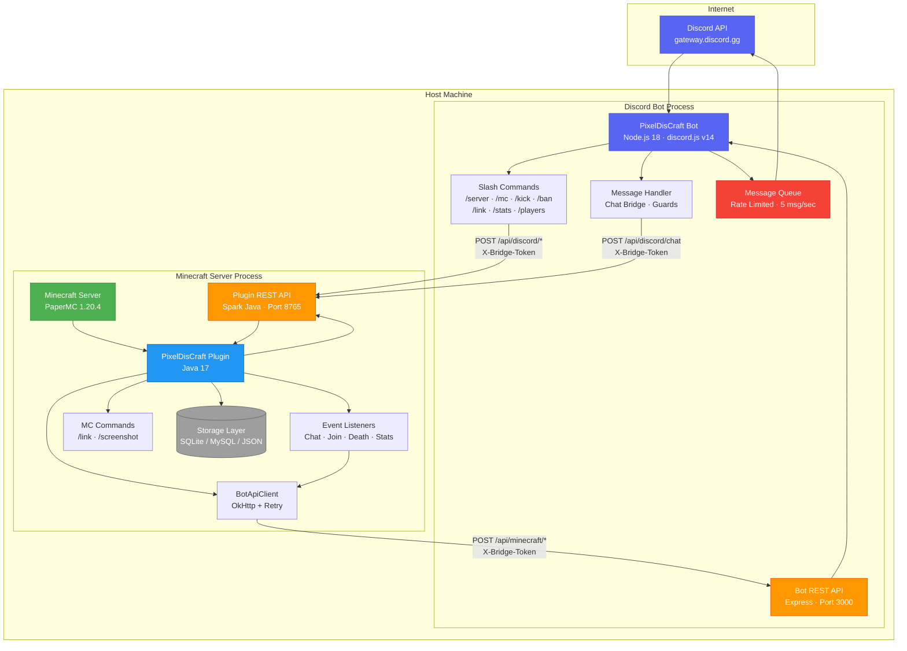
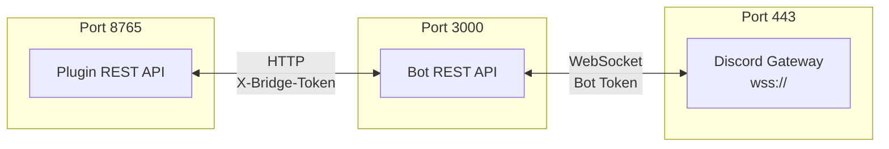
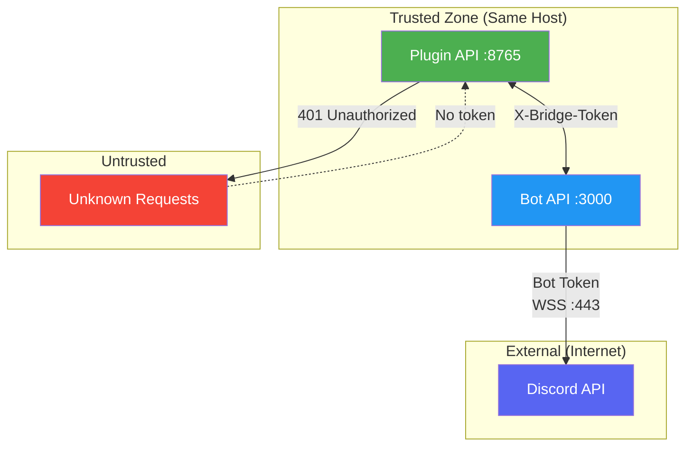

# System Architecture Diagram

> Visual overview of every component in the PixelDisCraft system and how they connect.

---

## Full System Architecture

---

## Component Legend

| Color | Component Type |
|-------|---------------|
| 🟢 Green | Minecraft Server |
| 🔵 Blue | PixelDisCraft Plugin / Bot |
| 🟠 Orange | REST API Endpoints |
| 🔴 Red | Rate Limiter / Queue |
| ⚪ Grey | Storage Layer |
| 🟣 Purple | Discord API |

---

## Network Ports

---

## Security Boundaries

