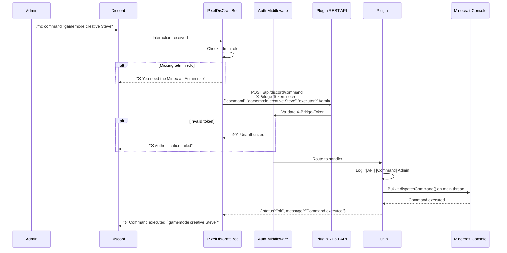
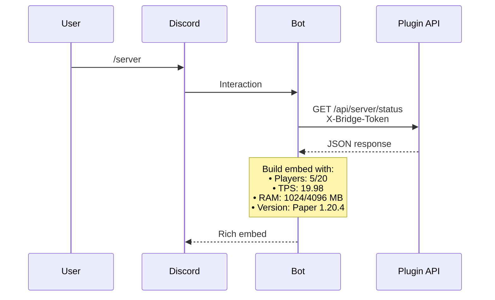
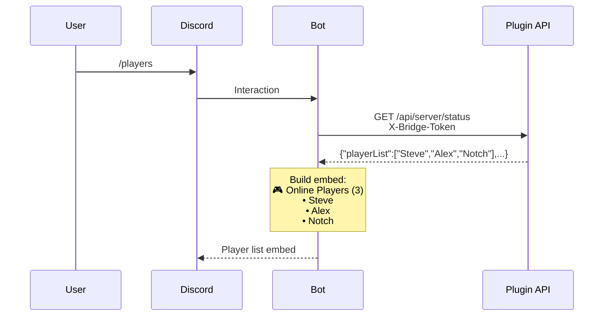
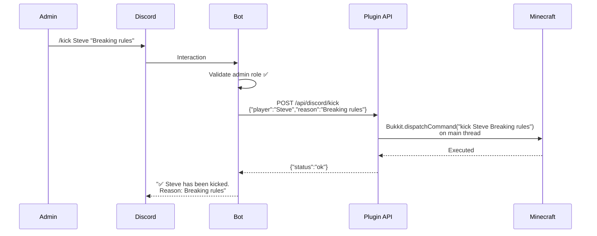
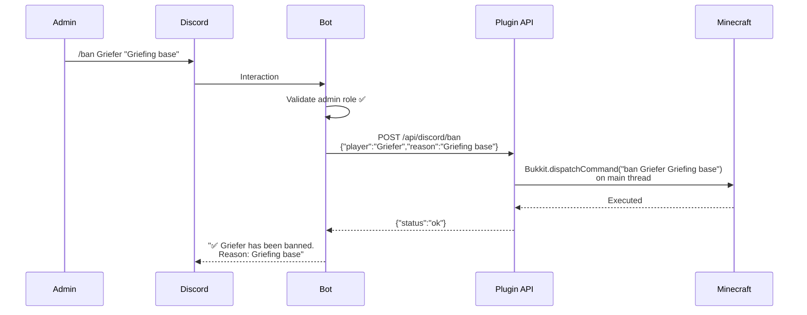
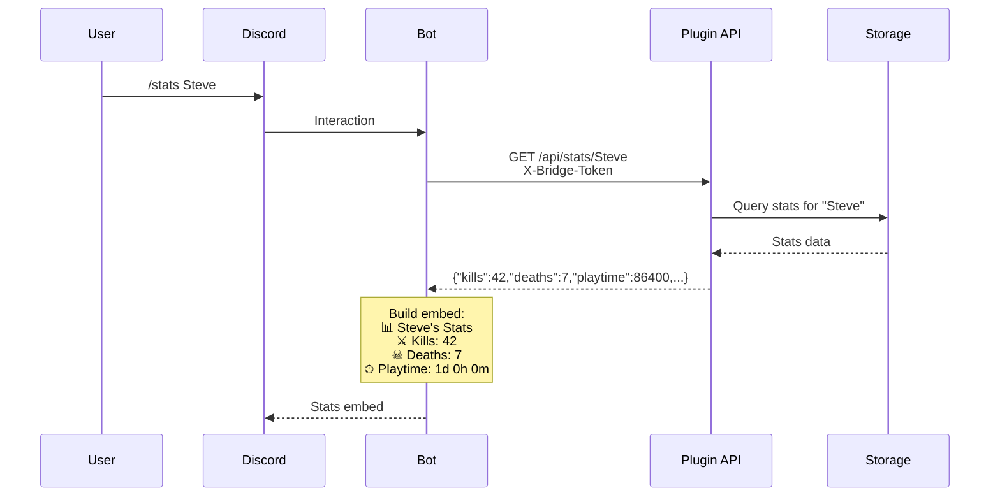
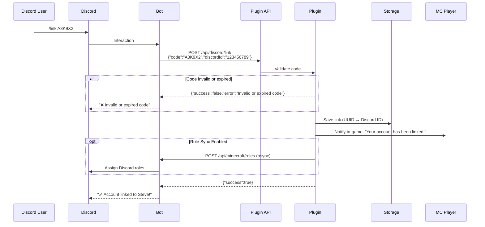
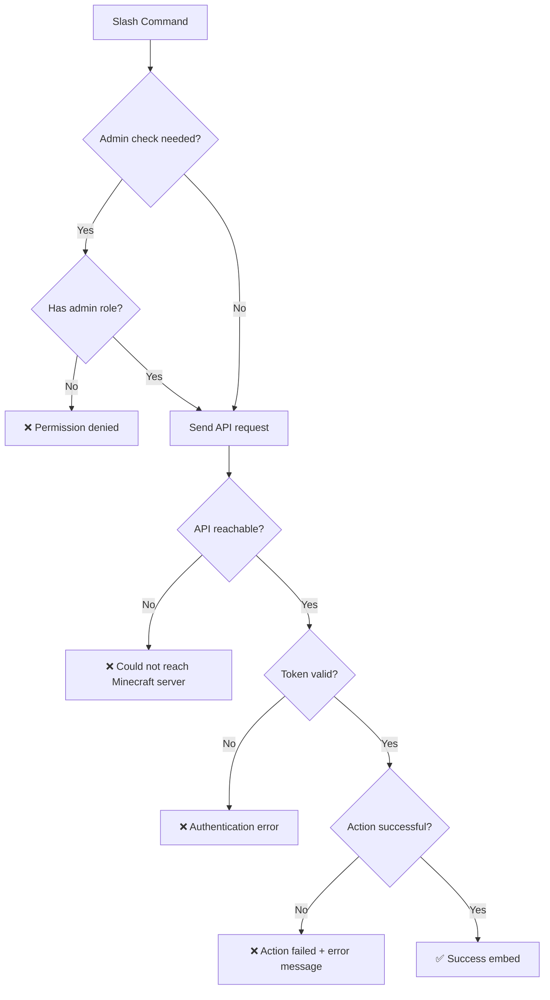

# Command Flow Diagram

> How Discord slash commands travel from Discord to the Minecraft server and back.

---

## Overview

All Discord → Minecraft commands follow this pattern:

1. Admin uses a slash command in Discord
2. Bot validates permissions
3. Bot sends an authenticated HTTP request to the plugin's REST API
4. Plugin executes the action on the Minecraft main thread
5. Plugin returns a response
6. Bot displays the result to the admin

---

## `/mc` — Execute Console Command

---

## `/server` — Server Status

---

## `/players` — Online Player List

---

## `/kick` — Kick Player

---

## `/ban` — Ban Player

---

## `/stats` — Player Statistics

---

## `/link` — Account Linking

---

## Error Handling Flow (All Commands)

