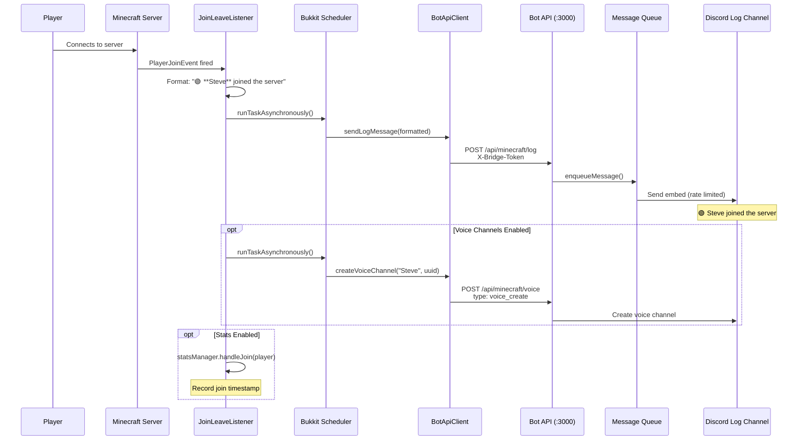
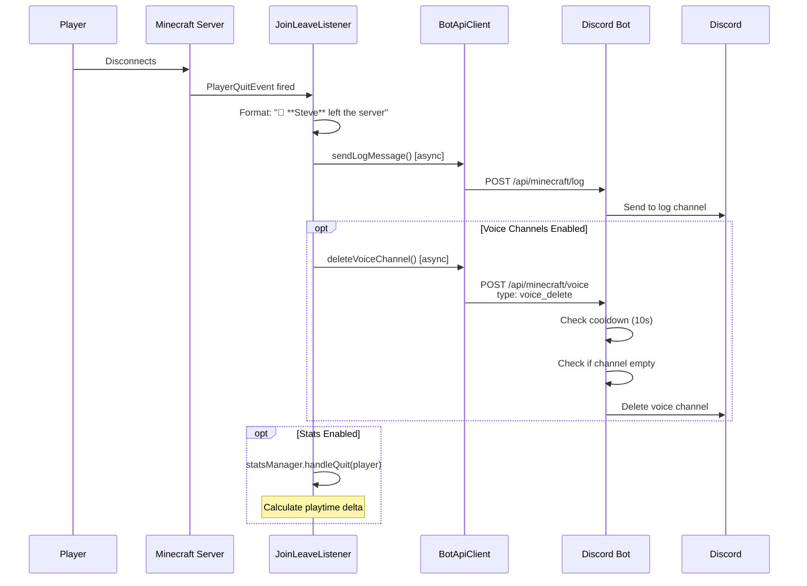
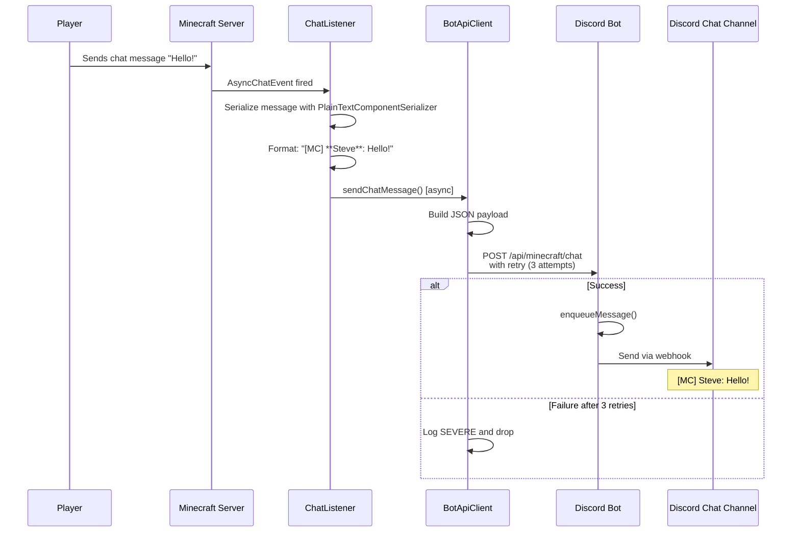
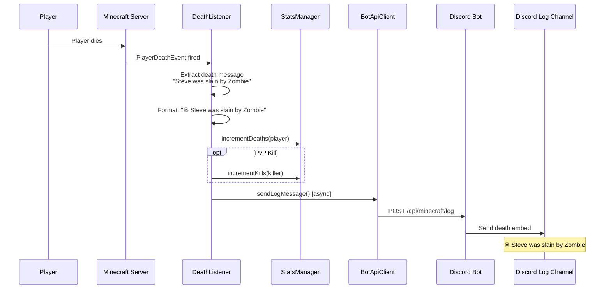
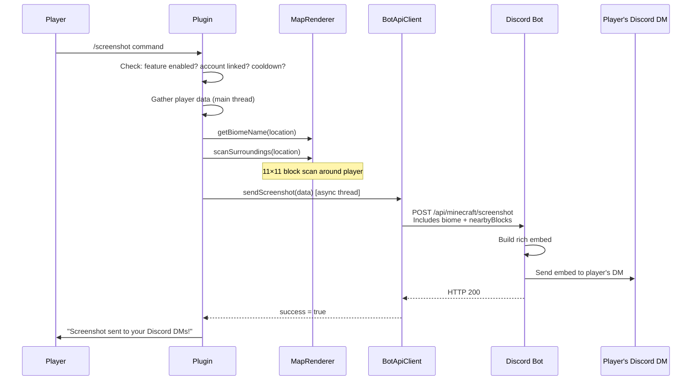
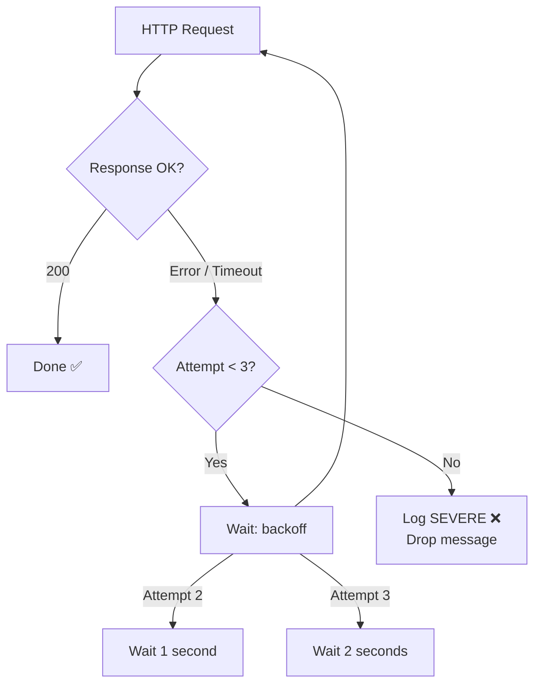

# Event Flow Diagram

> How Minecraft events travel from the game server to Discord channels.

---

## Overview

Every Minecraft event follows the same pattern:

1. Event fires on the Minecraft server
2. A **Listener** captures it
3. The data is formatted
4. An **async task** sends it to the bot via REST API
5. The bot posts it to the appropriate Discord channel

---

## Player Join Event

---

## Player Leave Event

---

## Chat Message Event

---

## Death Event

---

## Screenshot Event

---

## Retry Behavior (All Events)

