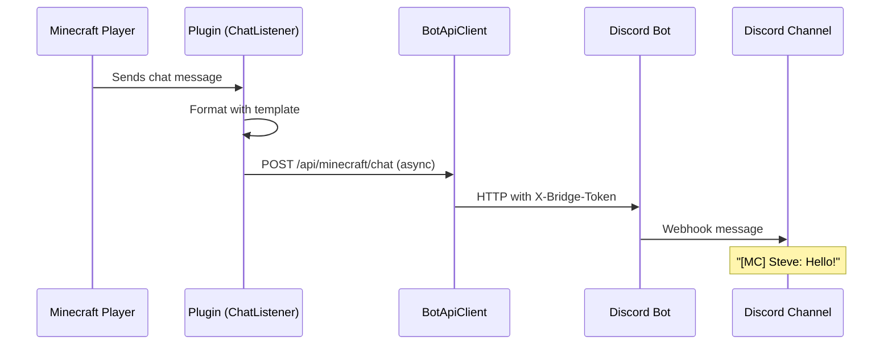
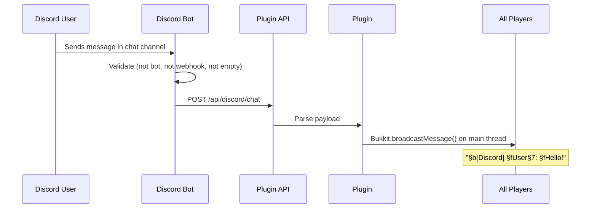
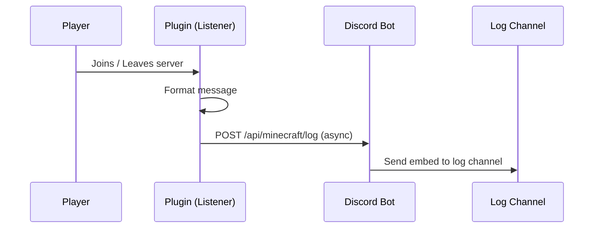
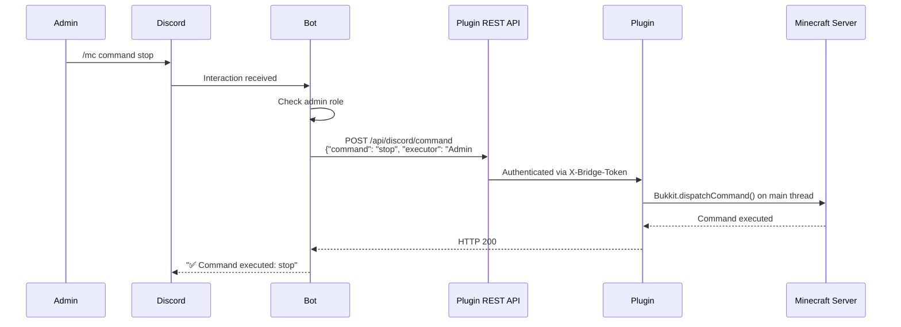
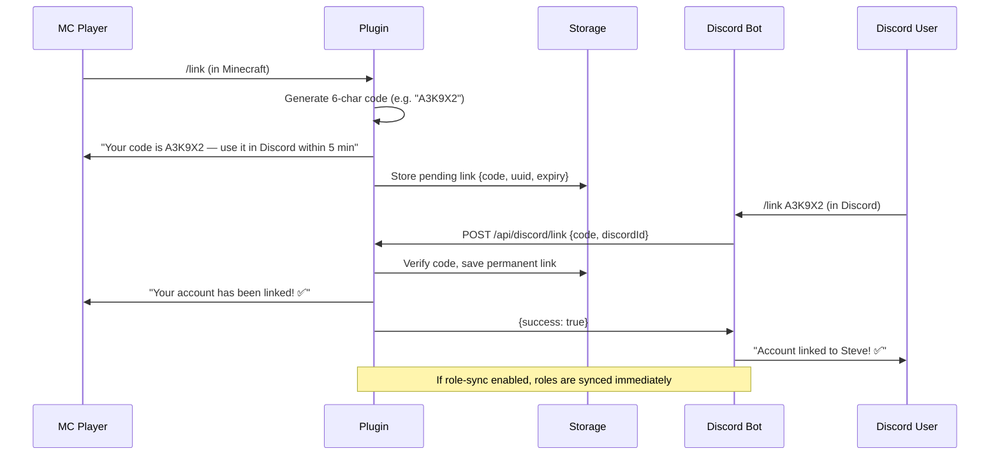

# How It Works

> A step-by-step walkthrough of every major flow in PixelDisCraft.

---

## 1. Chat Bridge Flow

### Minecraft → Discord

When a player sends a chat message in Minecraft:

1. **ChatListener** captures the `AsyncChatEvent`
2. The message is formatted using the configured template (e.g. `[MC] **Steve**: Hello!`)
3. An **async task** is scheduled via Bukkit's scheduler
4. `BotApiClient.sendChatMessage()` sends an HTTP POST to the bot's `/api/minecraft/chat` endpoint
5. The bot receives the payload and sends a **webhook message** to the configured Discord chat channel
6. The message appears in Discord with the player's name

### Discord → Minecraft

When a user sends a message in the linked Discord channel:

1. The bot's `messageCreate` event handler fires
2. Safety checks run: ignore bots, webhooks, system messages, empty content
3. The message is trimmed to 256 characters maximum
4. An HTTP POST is sent to the plugin's `/api/discord/chat` endpoint
5. The plugin formats the message (e.g. `§b[Discord] §fUser§7: §fHello!`)
6. The formatted message is **broadcast on the main thread** to all online players

---

## 2. Join / Leave Notification Flow

1. **JoinLeaveListener** captures `PlayerJoinEvent` or `PlayerQuitEvent`
2. Message is formatted (e.g. `🟢 **Steve** joined the server`)
3. An async task sends an HTTP POST to `/api/minecraft/log`
4. The bot posts the message to the Discord **log channel**

### Additional Actions on Join

- If **voice channels** are enabled, a personal voice channel is created
- If **stats tracking** is enabled, the player's join time is recorded

### Additional Actions on Leave

- The player's voice channel is deleted (if empty)
- Playtime is calculated and saved to storage

---

## 3. Death Message Flow

1. **DeathListener** captures `PlayerDeathEvent`
2. The death message is extracted (e.g. `Steve was slain by Zombie`)
3. Stats are updated (deaths incremented; killer's kills incremented if PvP)
4. The formatted message is sent to the log channel

---

## 4. Discord Command Flow

When an admin uses a slash command like `/mc command stop`:

### Available Commands

| Slash Command | Plugin Endpoint | Action |
|--------------|----------------|--------|
| `/server` | `GET /api/server/status` | Returns server status as embed |
| `/players` | `GET /api/server/status` | Lists online player names |
| `/mc <cmd>` | `POST /api/discord/command` | Executes console command |
| `/kick <player>` | `POST /api/discord/kick` | Kicks player with reason |
| `/ban <player>` | `POST /api/discord/ban` | Bans player with reason |
| `/stats <player>` | `GET /api/stats/:player` | Returns player statistics |
| `/link <code>` | `POST /api/discord/link` | Links Discord ↔ Minecraft account |

---

## 5. Account Linking Flow

---

## 6. Screenshot Flow

1. Player runs `/screenshot` in Minecraft
2. Plugin gathers: position, health, food, level, biome, nearby blocks
3. Data is sent async to the bot's `/api/minecraft/screenshot` endpoint
4. Bot builds a rich embed and sends it to the player's Discord DM (requires linked account)

---

## 7. Voice Channel Flow

1. **On join:** Plugin sends `voice_create` request → Bot creates a temporary voice channel
2. **On leave:** Plugin sends `voice_delete` request → Bot deletes the channel if empty
3. Safety: 10-second cooldown between create/delete, duplicate creation is skipped
