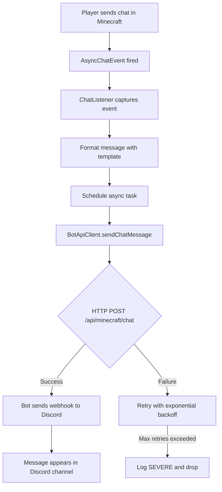
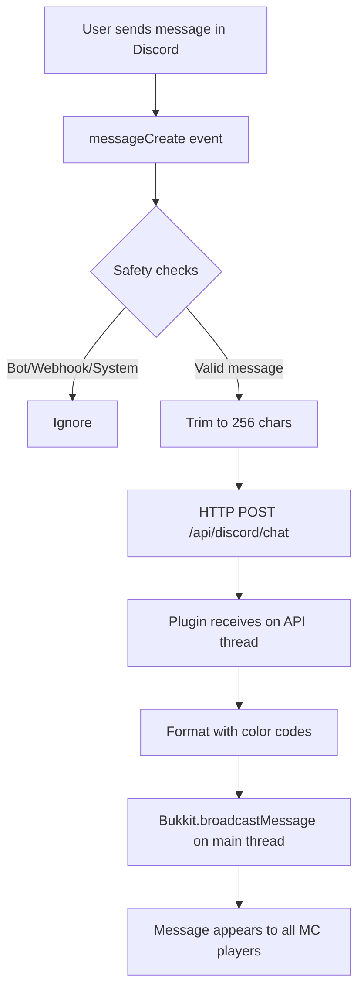
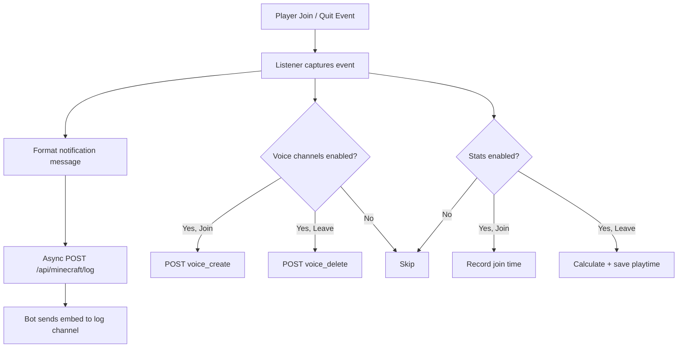
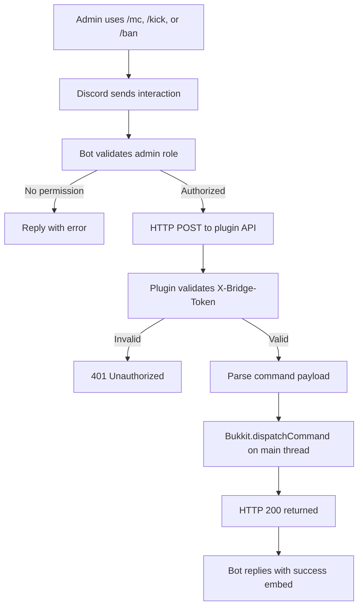
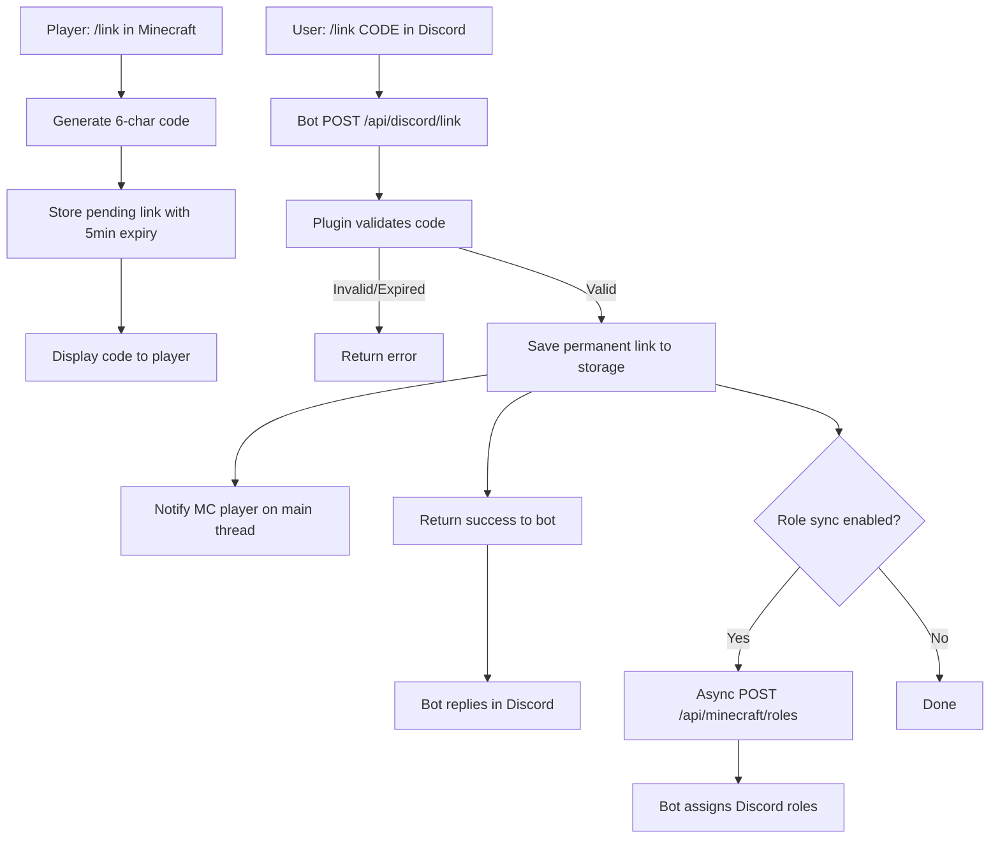

# System Flow

> Complete data flow reference for every interaction path in PixelDisCraft.

---

## Flow Summary Table

| Flow | Direction | Trigger | Endpoint |
|------|-----------|---------|----------|
| Chat message | MC → Discord | Player sends chat | `POST /api/minecraft/chat` |
| Chat message | Discord → MC | User sends message in channel | `POST /api/discord/chat` |
| Player join | MC → Discord | Player joins server | `POST /api/minecraft/log` |
| Player leave | MC → Discord | Player leaves server | `POST /api/minecraft/log` |
| Death event | MC → Discord | Player dies | `POST /api/minecraft/log` |
| Server status | Discord → MC | `/server` command | `GET /api/server/status` |
| Player list | Discord → MC | `/players` command | `GET /api/server/status` |
| Console command | Discord → MC | `/mc` command | `POST /api/discord/command` |
| Kick player | Discord → MC | `/kick` command | `POST /api/discord/kick` |
| Ban player | Discord → MC | `/ban` command | `POST /api/discord/ban` |
| Link account | Discord → MC | `/link` command | `POST /api/discord/link` |
| Player stats | Discord → MC | `/stats` command | `GET /api/stats/:player` |
| Screenshot | MC → Discord | `/screenshot` in-game | `POST /api/minecraft/screenshot` |
| Voice create | MC → Discord | Player joins | `POST /api/minecraft/voice` |
| Voice delete | MC → Discord | Player leaves | `POST /api/minecraft/voice` |
| Role sync | MC → Discord | Account linked | `POST /api/minecraft/roles` |

---

## Detailed Flows

### 1. Minecraft → Discord Chat



### 2. Discord → Minecraft Chat



### 3. Join / Leave



### 4. Slash Command Execution



### 5. Account Linking (Full Round-Trip)



---

## Request / Response Examples

### Chat Payload (MC → Discord)

```json
{
  "type": "chat",
  "formattedMessage": "[MC] **Steve**: Hello everyone!",
  "playerName": "Steve",
  "message": "Hello everyone!"
}
```

### Command Payload (Discord → MC)

```json
{
  "command": "gamemode creative Steve",
  "executor": "AdminUser#1234"
}
```

### Server Status Response

```json
{
  "online": true,
  "players": 5,
  "maxPlayers": 20,
  "tps1m": 19.98,
  "tps5m": 19.95,
  "tps15m": 19.97,
  "ramUsedMB": 1024,
  "ramMaxMB": 4096,
  "playerList": ["Steve", "Alex", "Notch", "Jeb", "Dinnerbone"],
  "version": "git-Paper-496 (MC: 1.20.4)",
  "motd": "A Minecraft Server"
}
```

---

## Security at Every Step

Every API request includes:

```
X-Bridge-Token: <shared_secret>
```

If the token is missing or incorrect:
- HTTP 401 is returned immediately
- The unauthorized request is logged with source IP
- No command or message is processed
